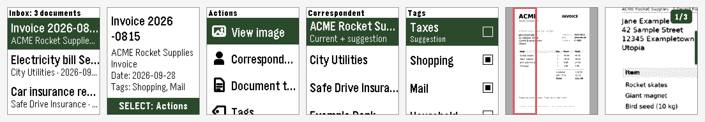

# Paperless for Pebble

Your [Paperless-ngx](https://docs.paperless-ngx.com/) inbox on your wrist.
Browse new documents, look at the scan, fix correspondent, type, tags and date,
and mark documents as done – right from your Pebble watch.



*Screenshots from the emulator with fictional sample data.*

[Deutsche Version](README.de.md) · [Changelog](CHANGELOG.md) · [Contributing](CONTRIBUTING.md)

If you enjoy the app, you can [buy me a coffee](https://buymeacoffee.com/michaelrunge) ☕ –
it's free and open source either way.

## Features

- **Inbox** – the newest documents tagged with your inbox tag, with correspondent and date
- **Document image** – the first page as a 4-level grayscale picture, plus a zoom that
  makes text readable. Split the page into columns, rows, or scroll freely.
  On Pebble Time 2 you can tap to zoom and drag with your finger.
- **Edit** – correspondent, document type, tags and date. Paperless' own suggestions
  are listed first.
- **Done** – removes the inbox tag, the next document moves up
- **German and English**
- **Private** – the app only talks to *your* Paperless server. Nothing else, no tracking.

## Requirements

- A Pebble watch. Made for **Pebble Time 2**; Pebble Time and Pebble 2 work too (smaller screen).
- The Pebble app on iPhone or Android
- A Paperless-ngx server reachable from your phone, and an API token

## Installation

1. Download `paperless-pebble.pbw` from the [latest release](../../releases/latest)
   and open it with the Pebble app, **or** build it yourself (see below).
2. In the Pebble app open **Paperless → Settings** and enter
   - your server URL, e.g. `https://paperless.example.com`
   - an API token (Paperless: profile, top right → *My Profile* → API auth token)
   - optionally the name of your inbox tag (empty = the tags marked as inbox tag in Paperless)

**Just want to try it?** Enter `demo` as server URL – the app then shows fictional sample
documents, no server or token needed.

## Using it

| Where | Button | Action |
|---|---|---|
| Inbox | UP / DOWN | browse |
| | SELECT | open document |
| | hold SELECT | reload |
| Document | SELECT | actions: view image, correspondent, document type, tags, date, done |
| | hold SELECT | mark as done |
| Actions | BACK after an action | returns to the actions |
| Image overview | UP / DOWN | move the red frame |
| | SELECT | zoom into the frame |
| Zoom | UP / DOWN | scroll |
| | SELECT | next column/row, or switch ↕/↔ when not split |
| | BACK | back to the overview |

**Split image** (setting): *Vertical* – columns, scroll up/down · *Horizontal* – rows,
scroll left/right · *Don't split* – the whole page, scroll in both directions.

## How it works

The watch never talks to the internet. PebbleKit JS on your phone calls the
Paperless REST API and sends prepared data to the watch via AppMessage.
Images are Paperless' WebP thumbnails, decoded on the phone in pure JavaScript
(the iOS Pebble app has no canvas), scaled, dithered to 4 grays and sent as 2-bit bitmaps.

Paperless endpoints used: `/api/documents/`, `/api/documents/{id}/thumb/`,
`/api/documents/{id}/suggestions/`, `PATCH /api/documents/{id}/`,
`/api/documents/bulk_edit/`, `/api/tags/`, `/api/correspondents/`, `/api/document_types/`.

## Building

```bash
# Linux / macOS / Windows (WSL) – see https://developer.repebble.com/sdk/
uv tool install pebble-tool --python 3.13
pebble sdk install latest

pebble build
pebble install --emulator emery     # emulator
pebble install --cloudpebble        # your watch (enable Dev Connect in the Pebble app)
```

Every push and release is also built automatically by GitHub Actions; the `.pbw`
is attached to each release.

## Project layout

| Path | Runs on | Purpose |
|---|---|---|
| `src/c/main.c` | watch | inbox, document view, messages, settings |
| `src/c/actions_window.c` | watch | actions screen with icons |
| `src/c/image_window.c` | watch | image overview and zoom, touch |
| `src/c/option_window.c` | watch | edit lists |
| `src/c/i18n.c` | watch | German/English texts |
| `src/c/paperless.h` | watch | message protocol (must match `index.js`) |
| `src/pkjs/index.js` | phone | Paperless API, control logic |
| `src/pkjs/image.js` | phone | scaling, splitting, dithering, 2-bit packing |
| `src/pkjs/webp.js` | phone | pure-JS WebP decoder (generated, see `tools/webp`) |
| `src/pkjs/config.js` | phone | settings page (Clay) |
| `src/pkjs/demo.js` | phone | demo mode with fictional sample data |
| `store/` | – | Appstore texts, icons and screenshots |

## Contributing

Bug reports, ideas and pull requests are welcome – see [CONTRIBUTING.md](CONTRIBUTING.md).

## How this was made

This app was developed with the help of AI (Claude by Anthropic): code, image
pipeline and documentation were written together with the AI, then built,
tested on a real Pebble Time 2 and reviewed by me. Issues and pull requests
are handled by a human – me.

## License

[MIT](LICENSE) © 2026 Michael Runge. Third-party code: see [THIRD_PARTY_NOTICES.md](THIRD_PARTY_NOTICES.md).

Not affiliated with the Paperless-ngx project or Core Devices.
